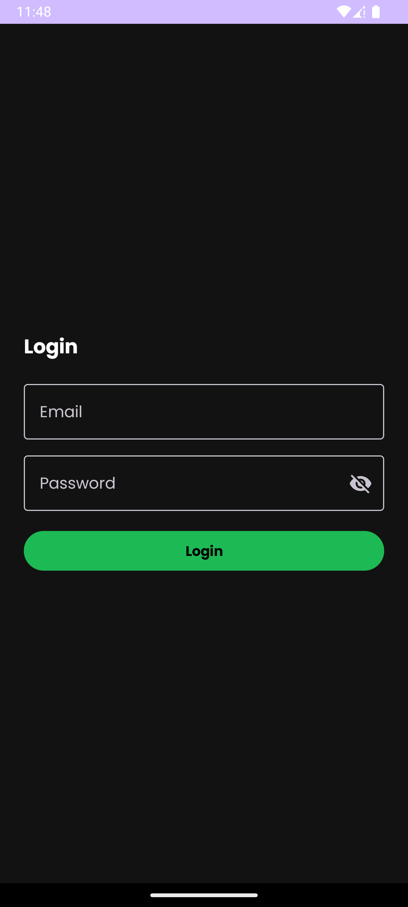
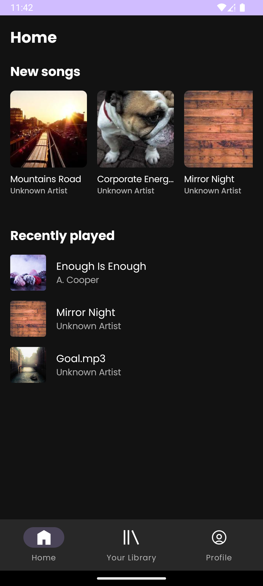
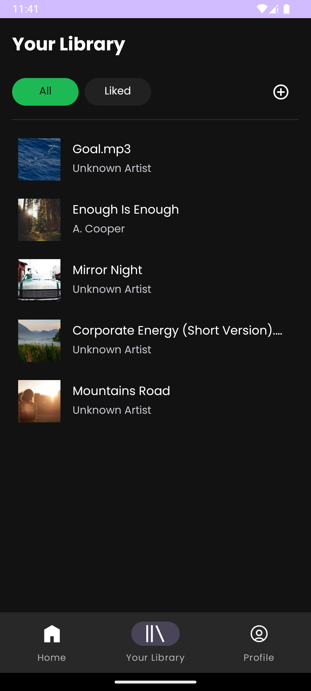
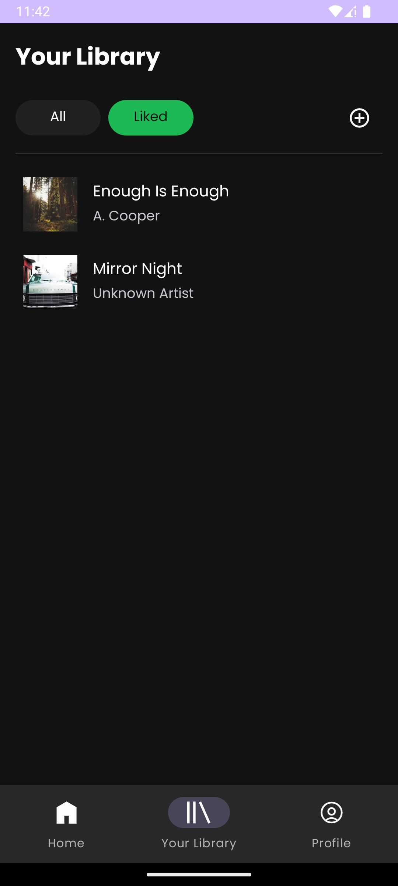
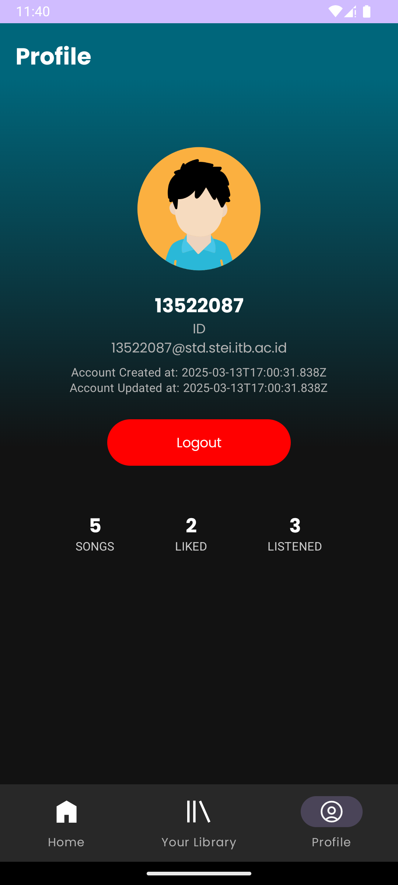
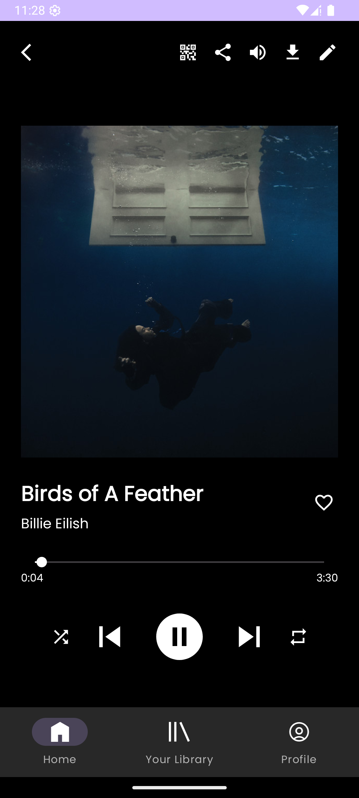
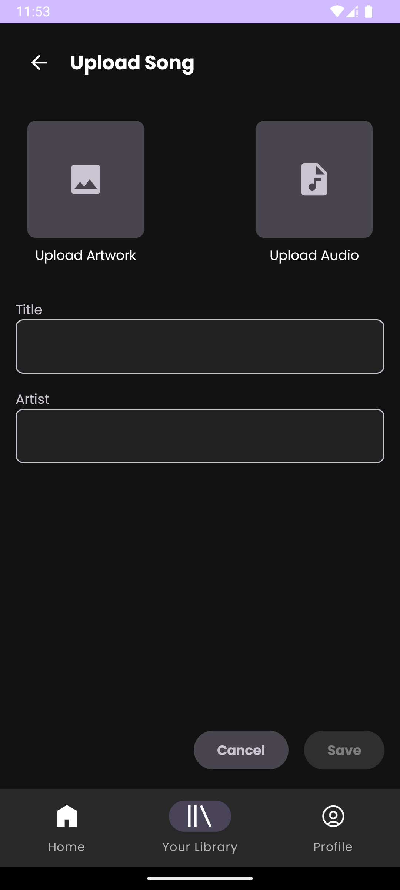
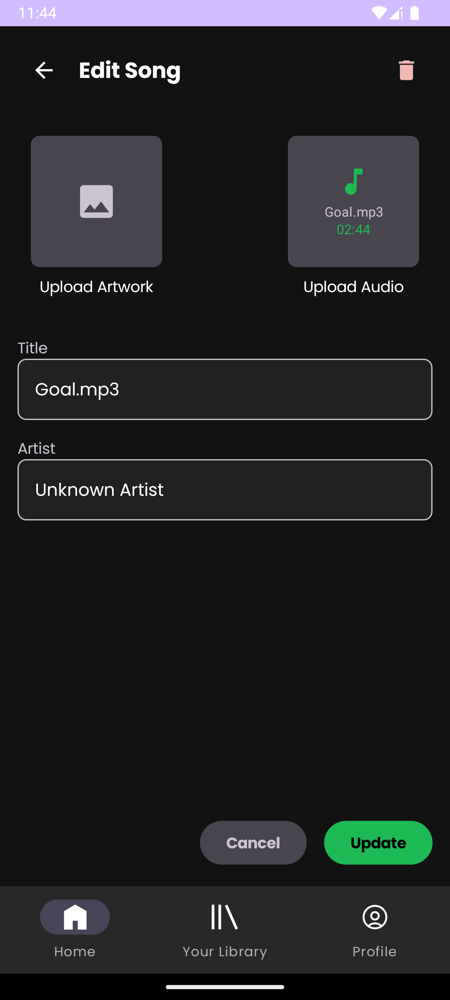
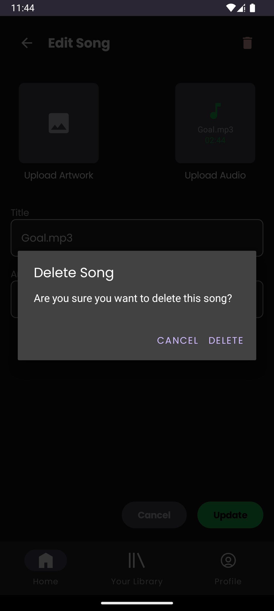

# Pada setiap repository ditambahkan sebuah README yang setidaknya berisi:

Screenshot aplikasi (dimasukkan dalam folder screenshot).

Jumlah jam persiapan dan pengerjaan untuk masing-masing anggota.

# Purrytify

Purrytify adalah aplikasi pemutar musik berbasis Android yang dikembangkan sebagai bagian dari Tugas Besar 1 mata kuliah IF3210 Pengembangan Aplikasi Piranti Bergerak di Institut Teknologi Bandung. Terinspirasi dari karakter agen rahasia Purry, aplikasi ini memungkinkan pengguna untuk login, menikmati koleksi lagu yang tersedia, memutar lagu secara interaktif, menyukai lagu, hingga mengelola lagu pribadi dari penyimpanan eksternal. Dengan fitur seperti mini player, player view, pencarian lagu, serta integrasi Room Database dan API eksternal, Purrytify tidak hanya menghadirkan pengalaman mendengarkan musik yang menyenangkan, tetapi juga menerapkan praktik terbaik Android Development, seperti pengelolaan token JWT, network sensing, background services, dan keamanan berbasis OWASP Mobile Top 10.

## Daftar Library

### 1. **Jetpack Compose**
   - **`androidx.compose.ui:ui`**: Library utama untuk membangun UI menggunakan Compose.
   - **`androidx.compose.foundation:foundation`**: Menyediakan komponen dasar untuk Compose.
   - **`androidx.compose.material3:material3`**: Implementasi Material Design 3 untuk Compose.
   - **`androidx.compose.material:material-icons-extended`**: Menyediakan ikon tambahan untuk Material Design.
   - **`androidx.compose.ui:ui-tooling-preview`**: Alat untuk pratinjau UI saat pengembangan.

### 2. **Coil**
   - **`io.coil-kt:coil-compose`**: Library untuk memuat gambar dengan Compose.

### 3. **Picasso**
   - **`com.squareup.picasso:picasso`**: Library untuk memuat dan mengelola gambar.

### 4. **Room**
   - **`androidx.room:room-runtime`**: Library untuk mengelola database lokal.
   - **`androidx.room:room-ktx`**: Ekstensi Kotlin untuk Room.
   - **`androidx.room:room-compiler`**: Compiler untuk Room (didefinisikan menggunakan KSP).

### 5. **Navigation**
   - **`androidx.navigation.fragment.ktx`**: Library untuk navigasi antar fragment.
   - **`androidx.navigation.ui.ktx`**: Library untuk mengelola UI navigasi.

### 6. **Lifecycle**
   - **`androidx.lifecycle:lifecycle-viewmodel-compose`**: Integrasi ViewModel dengan Compose.
   - **`androidx.lifecycle:livedata-ktx`**: Ekstensi Kotlin untuk LiveData.
   - **`androidx.lifecycle:viewmodel-ktx`**: Ekstensi Kotlin untuk ViewModel.

### 7. **RecyclerView**
   - **`androidx.recyclerview:recyclerview`**: Library untuk menampilkan daftar item.

### 8. **Glide**
   - **`com.github.bumptech.glide:glide`**: Library untuk memuat dan mengelola gambar.

### 9. **Retrofit**
   - **`com.squareup.retrofit2:retrofit`**: Library untuk melakukan permintaan jaringan.
   - **`com.squareup.retrofit2:converter-gson`**: Konverter untuk mengubah JSON menjadi objek Kotlin.

### 10. **WorkManager**
   - **`androidx.work:work-runtime-ktx`**: Library untuk menjalankan tugas latar belakang.

### 11. **Security**
   - **`androidx.security:security-crypto`**: Library untuk enkripsi dan keamanan data.

### 12. **Testing**
   - **`junit`**: Library untuk pengujian unit.
   - **`androidx.junit`**: Library untuk pengujian Android.
   - **`androidx.espresso.core`**: Library untuk pengujian UI.

## Versi
- **Kotlin**: 1.6.3
- **Compose**: 1.6.3
- **Room**: 2.7.0
- **Retrofit**: 2.9.0
- **WorkManager**: 2.8.1

## Pembagian Kerja Kelompok

### 13522015 
Persiapan 9 jam
Pengerjaan 43 jam
- Login & Logout (JWT token handling)
- Fetch & Sync Data dari API (Profile)
- Network Sensing (Notifikasi saat offline)
- Like/Unlike Song (sinkronisasi dengan backend)
- Implementasi background service untuk refresh token
- Error handling & logging

### 13522069
Persiapan 5 jam
Pengerjaan 45 jam
- Penambahan Lagu dari Storage (baca metadata, simpan ke database)
- Pengelolaan SQLite untuk metadata lagu
- Mini Player (interaksi dengan Now Playing)
- Edit & Hapus Lagu dari database
- Implementasi MediaMetadataRetriever
- Implementasi Now Playing (play/pause, next, previous, seekbar)

### 13522087
Persiapan 12 jam
Pengerjaan 44 jam
- Header & Navbar (Home, Library, Profile)
- Mini Player & Navigation
- Halaman Home (recently played & new songs)
- Library (All Songs & Liked Songs dengan RecyclerView)
- Form Tambah/Edit Lagu (UI saja, backend ditangani Person C)
- Profile Page (Tampilan user, statistik lagu, foto profil)

## Screenshot Aplikasi

### Login

### Home

### Library (All)

### Library (Liked)

### Profile

### Music Player (Now Playing)

### Add Song

### Song Player

### Edit Song

### Delete Confirmation

